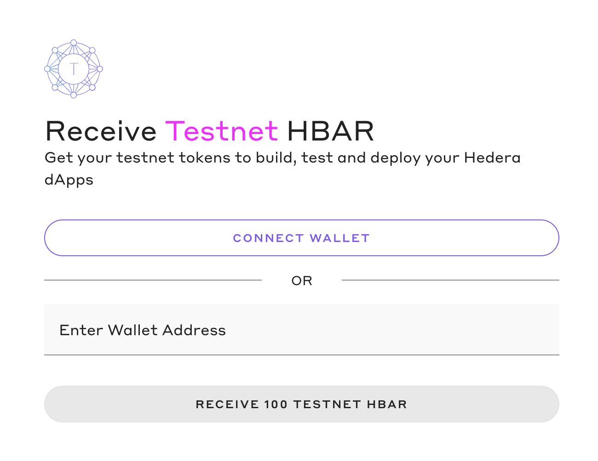

Hedera DApp Starter Template JavaScript using Create React App, Material UI with HashPack, Blade, Kabila and MetaMask wallet support.

## Prerequisites

### Hedera Testnet account

Don't have one? Create one by going to [portal.hedera.com](https://portal.hedera.com/register). The daily limit is 1000 test HBAR and users will be able to request for a refill every 24 hours!

### Hashpack Wallet
* Install the [Hashpack extension](https://chrome.google.com/webstore/detail/hashpack/gjagmgiddbbciopjhllkdnddhcglnemk).  


### Blade Wallet
* Install the [Blade extension](https://chrome.google.com/webstore/detail/blade-%E2%80%93-hedera-web3-digit/abogmiocnneedmmepnohnhlijcjpcifd).  


### Kabila Wallet
* Install the [Kabila extension](https://www.kabila.app/wallet).

### Metamask Wallet
* Install the [MetaMask extension](https://chrome.google.com/webstore/detail/metamask/nkbihfbeogaeaoehlefnkodbefgpgknn).
* Import a Hedera ECDSA based testnet account into MetaMask.  

#### How to activate your account on Hedera Testnet

Fund your account using our faucet at
https://portal.hedera.com/faucet



-----

## How to use
```npx create-react-app <app-name> --template hedera-dapp-template ```

----

## Examples
### Transfer HBAR
```tsx
<Stack
  direction='row'
  gap={2}
  alignItems='center'
>
  <Typography>
    Transfer
  </Typography>
  <TextField
    type='number'
    label='amount'
    value={amount}
    onChange={(e) => setAmount(parseInt(e.target.value))}
    sx={{
      maxWidth: '100px'
    }} />
  <Typography>
    HBAR
    to
  </Typography>
  <TextField
    value={toAccountId}
    onChange={(e) => setToAccountId(e.target.value)}
    label='account id or evm address'
  />
  <Button
    variant='contained'
    onClick={async () => {
      const txId = await walletInterface.transferHBAR(toAccountId, amount);
    }}
  >
    <SendIcon />
  </Button>
</Stack>
```
### Transfer a Fungible/ERC20 Token

```tsx
<Button
  variant='contained'
  onClick={async () => {
    const txId = await walletInterface.transferToken(toAccountId, TokenId.fromString(tokenId), amount);
  }}
>
  Transfer Token
</Button>

<Button
  variant='contained'
  onClick={async () => {
    const txId = await walletInterface.associateToken(TokenId.fromString(tokenId));
  }}
>
  Associate Token
</Button>
```
### Executing Two Contract Functions

```tsx
<Button
  variant='contained'
  onClick={async () => {
    const txId = await walletInterface.executeContractFunction(ContractId.fromString(contractId), "createTodo", new ContractFunctionParameterBuilder().addParam({ type: "string", name: "todoName", value: "Testing Totoro" }), 5000000);
  }}
>
  Execute Contract Function
</Button>
<Button
  variant='contained'
  onClick={async () => {
    const txId = await walletInterface.executeContractFunction(ContractId.fromString(contractId), "getTodoById", new ContractFunctionParameterBuilder().addParam({ type: "uint256", name: "todoId", value: 1 }), 5000000);
  }}
>
  Execute Contract Function 2
</Button>
```
### Mirror Node Query: Get Account Info By Account Id

```tsx
<Stack>
  <Button
    variant='contained'
    onClick={async () => {
      const mirrorNodeClient = new MirrorNodeClient(appConfig.networks.testnet);
      const accountInfo = await mirrorNodeClient.getAccountInfo(accountId);
      console.log(accountInfo.balance);
    }}
  >
    Query for Account Info
  </Button>
</Stack>
```

---

## JSON RPC Relay Endpoint Alternatives
### Set up your own Hedera JSON RPC relay
Check out the Hedera JSON RPC relay GitHub repo [here](https://github.com/hashgraph/hedera-json-rpc-relay) and set up an RPC relay to run locally.

### Arkhia
Arkhia offers another community JSON RPC relay that you can leverage. Sign up for free and get started [here](https://www.arkhia.io/features/#api-services).